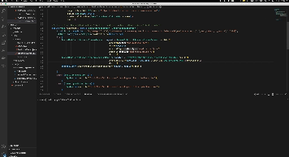

# Quick Start for Bedrock Java SDK with Claude Model

## 1. Demo Summary

This readme file describes the steps to quickly get started with Bedrock Java SDK for Claude in your AWS account. We assumed that the IAM role is created with the required Trust relationship and policies to access Bedrock. The Demo uses default IAM credential to access Bedrock.

This repository contains mainly two files:
- bedrockDemo.java:  the file demonstrates the usage of invokeModel with the Anthropic Claude model.
- bedrockDemoStream.java: the file demonstrates the usage of invokeModelWithResponseStream with the Anthropic Claude model.

The latest Bedrock Java SDK: [Link](https://sdk.amazonaws.com/java/api/latest/software/amazon/awssdk/services/bedrockruntime/package-summary.html)

## 2. Java SDK for Bedrock

 Java SDK supports  Bedrock since 2.20.162

Pom.xml sample:

```
<properties>
        ......
        <aws.java.sdk.version>2.20.160</aws.java.sdk.version>
        ......
    </properties>
```

## 3. IAM Settings

Create user with Bedrock accessing privileges:

```
{
    "Version": "2012-10-17",
    "Statement": [
        {
            "Sid": "VisualEditor0",
            "Effect": "Allow",
            "Action": "bedrock:*",
            "Resource": "*"
        }
    ]
}
```


## 4. Code Details 

Here are the steps in details:

1. create Bedrock client:
    Create a builder that can be used to configure 

    ```
    BedrockRuntimeAsyncClient bedrockClient = BedrockRuntimeAsyncClient.builder()
                    .endpointOverride(URI.create("https://bedrock-runtime.us-east-1.amazonaws.com"))
                    .region(Region.US_EAST_1)
                    .credentialsProvider(DefaultCredentialsProvider.create())
                    .build();
    ```

    Or create the client with default region and default credentials.

    ```
    BedrockRuntimeAsyncClient bedrockClient = BedrockRuntimeAsyncClient.create();
    ```

1. prepare the prompts for Claude model.
    The inference parameters are different for each foundation models. When you make an [InvokeModel](https://docs.aws.amazon.com/bedrock/latest/APIReference/API_InvokeModel.html) or [InvokeModelWithResponseStream](https://docs.aws.amazon.com/bedrock/latest/APIReference/API_InvokeModelWithResponseStream.html) call using an Anthropic model, fill the `body` field with a JSON object that conforms to the one below. Copy the format in the `prompt` field, replacing `prompt` with your prompt.

    ```
    {
        "prompt": "\n\nHuman:<prompt>\n\nAssistant:",
        "temperature": float,
        "top_p": float,
        "top_k": int,
        "max_tokens_to_sample": int,
        "stop_sequences": ["\n\nHuman:"]
    }
    ```

    Here is the example:

    ```
    String bodyString ="{\"prompt\": \"\\n\\nHuman:Hello\\n\\nAssistant:\", \"max_tokens_to_sample\": 100}";
    SdkBytes bodyBytes = SdkBytes.fromUtf8String(bodyString);
    ```

1. Invoke Model with Request.

## 5. Output Video

<a href="https://www.bilibili.com/video/BV14w411r72K/?t=41.1&vd_source=c959b3a726cc65bf153252d9748baa6f" title="StreamDemo"></a>

<<<<<<< HEAD

{:height="2000px" width="3200px"}


=======
You can also check the video from the videos dir.
>>>>>>> 86558d10cc5bcdbc60bf562e6ffeb32084b99b4c

Congratulations! You now have a working Bedrock testbed.

